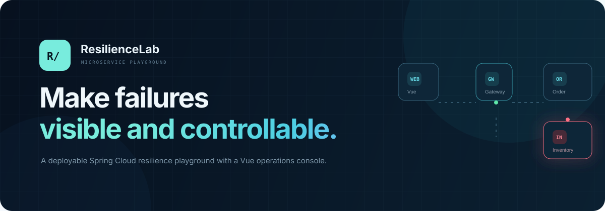
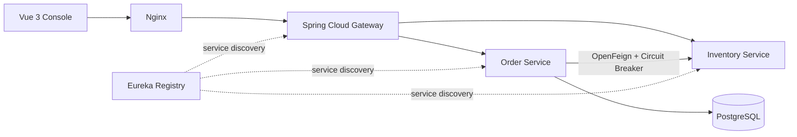

<p align="center">
  
</p>

<p align="center">
  <strong>一个可以真实部署、零大模型 API 成本的微服务可观测与故障演练平台。</strong>
</p>

<p align="center">
  
  
  
  
  <a href="LICENSE"></a>
</p>

## 为什么做这个项目

普通 CRUD 很难展示对分布式系统的理解。ResilienceLab 用一条可操作的订单调用链，把服务发现、网关路由、负载均衡、熔断降级、链路标识、故障注入和事件观测串成一个完整闭环。

所有订单和库存均为程序生成的合成数据，不采集真实用户信息，不调用大模型，也不依赖付费 API。

## 能看到什么

- 一键切换 `NORMAL`、`SLOW`、`ERROR`、`FLAKY` 四种库存服务状态
- 从 Vue 控制台发起订单演练，观察故障沿 `Gateway → Order → Inventory` 传播
- Resilience4j 熔断器在 `CLOSED / OPEN / HALF_OPEN` 间转换
- 每个请求由网关生成 `X-Trace-Id`，事件时间线可追踪结果和延迟
- H2 支持本地零配置启动，Docker Compose 使用 PostgreSQL 持久化
- 对公开演练的写请求做频率限制，故障延迟硬限制为 2.5 秒

## 快速启动

需要 Docker 24+ 与 Docker Compose v2。

```bash
cp .env.example .env
# 修改 .env 中的数据库密码
docker compose up --build -d
```

浏览器打开 <http://localhost:3000>。首次构建需要下载镜像和依赖，服务注册通常还需要等待十几秒。

停止服务：

```bash
docker compose down
```

数据库保存在 `postgres-data` volume 中。只有明确不再需要数据时才执行 `docker compose down -v`。

## 架构



更完整的设计说明见 [docs/architecture.md](docs/architecture.md)。

## 故障场景

| 场景 | Inventory 行为 | 预期观察 |
| --- | --- | --- |
| NORMAL | 正常返回合成库存 | 请求成功，熔断器保持关闭 |
| SLOW | 延迟 100–2500 ms | P95 上升，调用仍可完成 |
| ERROR | 持续返回 503 | 降级事件增加，熔断器开启 |
| FLAKY | 每两次调用失败一次 | 成功率波动，达到阈值后熔断 |

## 本地开发

需要 JDK 21+、Maven 3.9+、Node.js 22+。

后端测试：

```bash
mvn test
```

按顺序在四个终端启动：

```bash
mvn -pl service-registry spring-boot:run
mvn -pl inventory-service spring-boot:run
mvn -pl order-service spring-boot:run
mvn -pl api-gateway spring-boot:run
```

前端开发服务器：

```bash
cd frontend
npm ci
npm run dev
```

访问 <http://localhost:5173>。Vite 会把 `/api` 代理到本机网关的 `8080` 端口。

## API 摘要

| 方法 | 路径 | 用途 |
| --- | --- | --- |
| `GET` | `/api/overview` | 成功率、P95 与熔断状态 |
| `GET` | `/api/events?limit=20` | 最近调用事件 |
| `POST` | `/api/orders/simulate` | 发起一次订单演练 |
| `GET` | `/api/operations/scenario` | 查询当前故障场景 |
| `PUT` | `/api/operations/scenario` | 切换受控故障场景 |

## 部署与开源

- [部署手册](docs/deployment.md)：域名、HTTPS、备份、日志和大陆地区上线检查项
- [简历与面试笔记](docs/resume-notes.md)：可验证指标、项目描述模板和追问清单
- [贡献指南](CONTRIBUTING.md)：开发、测试和提交约定
- [安全策略](SECURITY.md)：漏洞报告方式与公开部署边界

欢迎提交 Issue 或 Pull Request。路线图优先考虑 OpenTelemetry、Prometheus/Grafana、JWT 管理端鉴权和自动化压测报告。

## License

[MIT](LICENSE) © ResilienceLab contributors
